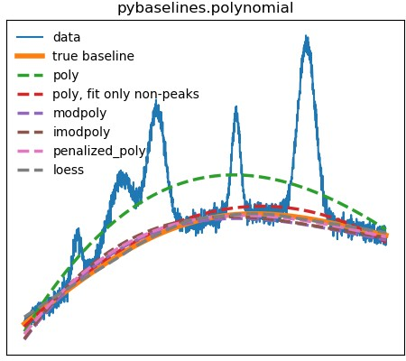
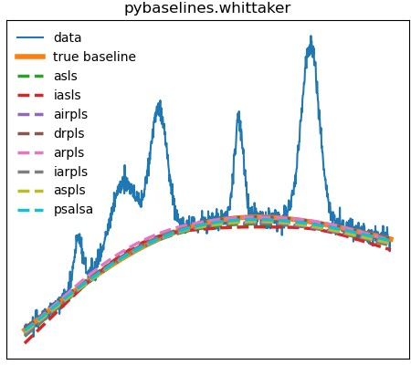
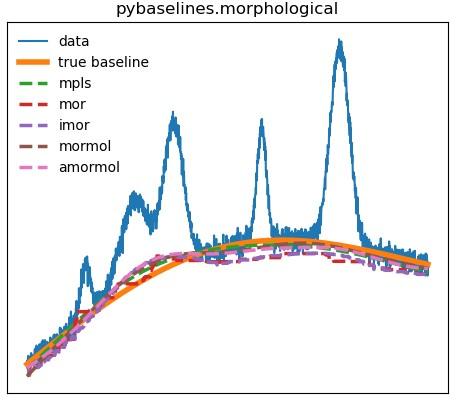
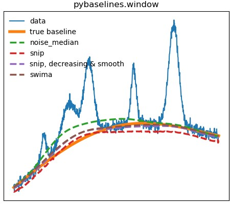
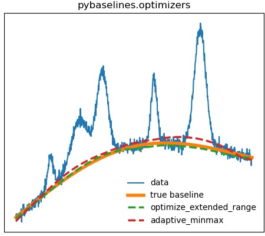

==========
Algorithms
==========

The current available baseline algorithms in pybaselines are split into
polynomial, whittaker, morphological, and window. Note that this classification
is more for grouping code, and not a hard classification of the algorithms.

Plots showing the various baseline algorithms are shown below (note that the
baselines in the figures are to show examples for each algorithm, and that most
are not fully optimized for the data).

.. toctree::
   :maxdepth: 2
   :caption: Contents:

   polynomial
   whittaker
   morphological
   window
   optimizers
   misc
