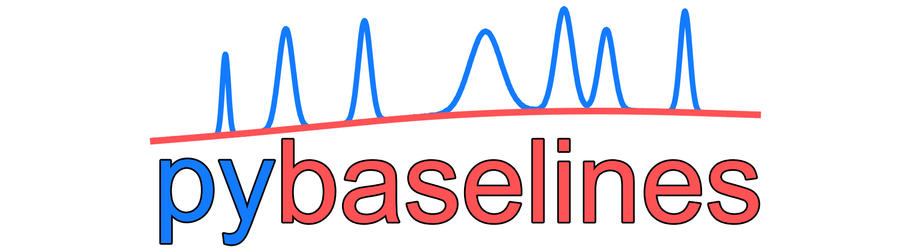

=========================
pybaselines Documentation
=========================

pybaselines is a library of algorithms for the baseline correction of experimental data.

* For Python 3.10 or later
* Open Source: BSD 3-Clause License
* Source Code: https://github.com/derb12/pybaselines
* Documentation: https://pybaselines.readthedocs.io.

..
  NOTE: For reference on the grid and octicons options below, see https://sphinx-design.readthedocs.io
  For octicons, '3em' == 3 times height of font; 'sd-text-primary' is CSS for
  'sd' == sphinx-design, 'text' == the thing being modified, 'primary' == color name
  and the '^^^' makes the octicon a header

.. grid:: 1 2 2 3
  :gutter: 2

  .. grid-item-card::
    :link: getting_started/index
    :link-type: doc
    :text-align: center

    :octicon:`rocket;3em;sd-text-primary`

    **Getting Started**
    ^^^

    A quick introduction to baseline correction, installing pybaselines, and
    basic usage.

  .. grid-item-card::
    :link: user_guide/index
    :link-type: doc
    :text-align: center

    :octicon:`book;3em;sd-text-primary`

    **User Guide**
    ^^^

    In-depth explanations and example fits for all baseline correction
    algorithms in pybaselines, as well as additional details for
    specific use cases.

  .. grid-item-card::
    :link: generated/examples/index
    :link-type: doc
    :text-align: center

    :octicon:`graph;3em;sd-text-primary`

    **Examples**
    ^^^

    Gallery of examples showing various uses of pybaselines.

  .. grid-item-card::
    :link: api/index
    :link-type: doc
    :text-align: center

    :octicon:`code-square;3em;sd-text-primary`

    **API Reference**
    ^^^

    Detailed descriptions of all public modules, classes, methods,
    and functions within pybaselines, including their full parameter listing.

  .. grid-item-card::
    :link: contributing
    :link-type: doc
    :text-align: center

    :octicon:`tools;3em;sd-text-primary`

    **Contributing**
    ^^^

    Details on how to report bugs, give feedback, and contribute code
    to pybaselines.

  .. grid-item-card::
    :link: about/index
    :link-type: doc
    :text-align: center

    :octicon:`info;3em;sd-text-primary`

    **About**
    ^^^

    Release notes, citation guidelines, and other metadata about pybaselines.

.. toctree::
   :maxdepth: 2
   :hidden:

   getting_started/index
   user_guide/index
   generated/examples/index
   api/index
   contributing
   about/index
