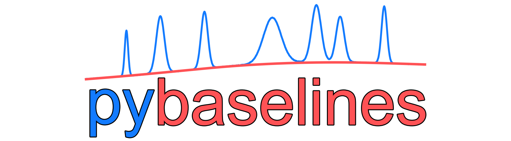

pybaselines Documentation
=========================

pybaselines is a library of algorithms for the baseline correction of experimental data.

* For Python 3.9 or later
* Open Source: BSD 3-Clause License
* Source Code: https://github.com/derb12/pybaselines
* Documentation: https://pybaselines.readthedocs.io.

.. toctree::
   :maxdepth: 2
   :caption: Contents:

   introduction
   installation
   quickstart
   algorithms/index
   parameter_selection
   performance
   generated/examples/index
   api/index
   changes
   contributing
   citing
   license
   authors
