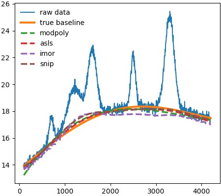

===========
Quick Start
===========

To use the various functions in pybaselines, simply input the measured
data and any required parameters. All baseline correction functions in pybaselines
will output two items: a numpy array of the calculated baseline and a
dictionary of potentially useful parameters.

A simple example is shown below.

.. note::
    Beginning in version 1.0.0, pybaselines introduced a class-based api
    which allows for easier usage and allows all algorithms to be called from
    the :class:`.Baseline` object. If using an earlier version, refer to the
    :ref:`quickstart:Pre-Version-1.0.0 Quick Start` section below or the
    `old documentation <https://pybaselines.readthedocs.io/en/v0.8.0/>`_.

.. code-block:: python

    import matplotlib.pyplot as plt
    import numpy as np
    from pybaselines import Baseline, utils

    x = np.linspace(1, 1000, 1000)
    # a measured signal containing several Gaussian peaks
    signal = (
        utils.gaussian(x, 4, 120, 5)
        + utils.gaussian(x, 5, 220, 12)
        + utils.gaussian(x, 5, 350, 10)
        + utils.gaussian(x, 7, 400, 8)
        + utils.gaussian(x, 4, 550, 6)
        + utils.gaussian(x, 5, 680, 14)
        + utils.gaussian(x, 4, 750, 12)
        + utils.gaussian(x, 5, 880, 8)
    )
    # exponentially decaying baseline
    true_baseline = 2 + 10 * np.exp(-x / 400)
    noise = np.random.default_rng(1).normal(0, 0.2, x.size)

    y = signal + true_baseline + noise

    baseline_fitter = Baseline(x, check_finite=False)

    bkg_1 = baseline_fitter.modpoly(y, poly_order=3)[0]
    bkg_2 = baseline_fitter.asls(y, lam=1e7, p=0.02)[0]
    bkg_3 = baseline_fitter.mor(y, half_window=30)[0]
    bkg_4 = baseline_fitter.snip(
        y, max_half_window=40, decreasing=True, smooth_half_window=3
    )[0]

    plt.plot(x, y, label='raw data', lw=1.5)
    plt.plot(x, true_baseline, lw=3, label='true baseline')
    plt.plot(x, bkg_1, '--', label='modpoly')
    plt.plot(x, bkg_2, '--', label='asls')
    plt.plot(x, bkg_3, '--', label='mor')
    plt.plot(x, bkg_4, '--', label='snip')

    plt.legend()
    plt.show()

The above code will produce the image shown below.

Pre-Version-1.0.0 Quick Start
-----------------------------

.. code-block:: python

    import matplotlib.pyplot as plt
    import numpy as np
    import pybaselines
    from pybaselines import utils

    x = np.linspace(1, 1000, 1000)
    # a measured signal containing several Gaussian peaks
    signal = (
        utils.gaussian(x, 4, 120, 5)
        + utils.gaussian(x, 5, 220, 12)
        + utils.gaussian(x, 5, 350, 10)
        + utils.gaussian(x, 7, 400, 8)
        + utils.gaussian(x, 4, 550, 6)
        + utils.gaussian(x, 5, 680, 14)
        + utils.gaussian(x, 4, 750, 12)
        + utils.gaussian(x, 5, 880, 8)
    )
    # exponentially decaying baseline
    true_baseline = 2 + 10 * np.exp(-x / 400)
    noise = np.random.default_rng(1).normal(0, 0.2, x.size)

    y = signal + true_baseline + noise

    bkg_1 = pybaselines.polynomial.modpoly(y, x, poly_order=3)[0]
    bkg_2 = pybaselines.whittaker.asls(y, lam=1e7, p=0.02)[0]
    bkg_3 = pybaselines.morphological.mor(y, half_window=30)[0]
    bkg_4 = pybaselines.smooth.snip(
        y, max_half_window=40, decreasing=True, smooth_half_window=3
    )[0]

    plt.plot(x, y, label='raw data', lw=1.5)
    plt.plot(x, true_baseline, lw=3, label='true baseline')
    plt.plot(x, bkg_1, '--', label='modpoly')
    plt.plot(x, bkg_2, '--', label='asls')
    plt.plot(x, bkg_3, '--', label='mor')
    plt.plot(x, bkg_4, '--', label='snip')

    plt.legend()
    plt.show()

The above code will produce the same image as shown above.
